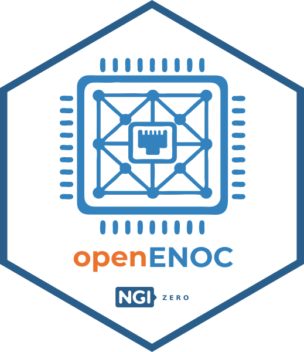

# Ethernet-based Network-On-Chip

By using standard Ethernet Layer-2 as the native on-chip transport protocol, **`openENOC`** connects processors, accelerators and peripherals in a flexible, frame-switched network.

It lowers the barrier to entry for building complex systems.

It bridges the gap between the on-chip and off-chip networking.

   

The project provides a complete, permissively-licensed stack, including RTL components, integration APIs, verification infrastructure and reference designs. It targets workloads where traditional interconnects struggle to scale, such as cryptography and edge computing.

All results are publicly released to support reuse, strengthen the opensource ecosystem and empower developers to build future-proof, interoperable, community-driven MPSoC solutions.

👉 [Link](https://github.com/eniokaljic/openENOC) for additional detail.

--------------------

### Acknowledgements
We are grateful to **NLnet Foundation** for their sponsorship of this development activity.

   
   

This project was funded through the NGI0 Commons Fund, a fund established by NLnet with financial support from the European Commission's Next Generation Internet programme, under the aegis of DG Communications Networks, Content and Technology under grant agreement No 101135429. Additional funding is made available by the Swiss State Secretariat for Education, Research and Innovation (SERI).

----
#### End-of-Document
